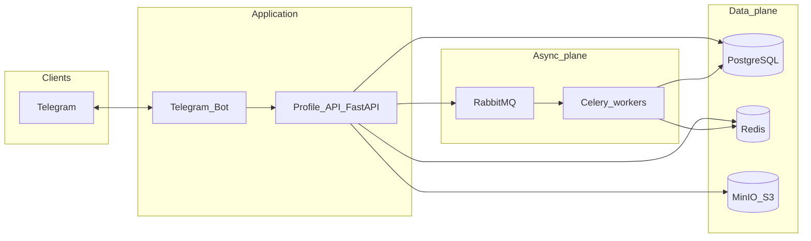
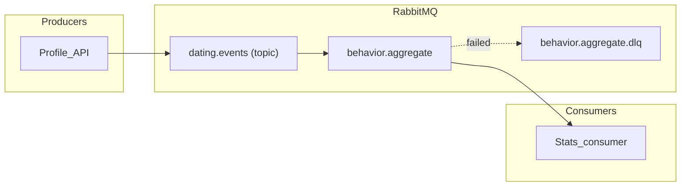
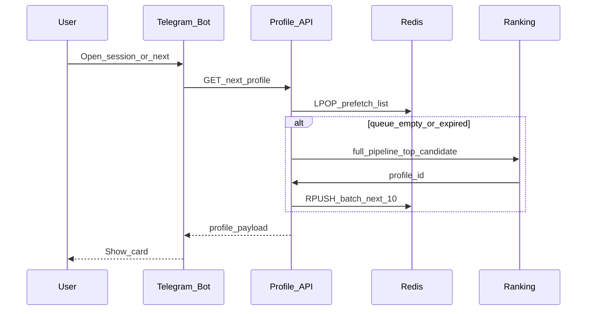

# Architecture

End-to-end design for the dating bot: Telegram client, FastAPI profile service, PostgreSQL, Redis prefetch, RabbitMQ (events and task queue), MinIO for media, Celery workers + scheduled jobs.


## High-level diagram



## RabbitMQ routing (design)

- **Producers:** **Profile API only** — the bot calls the API; events are published after successful persistence (single path, no duplicate publishes).
- **Exchange:** `dating.events` — type **topic** (or **headers** if you prefer explicit routing keys only).
- **Routing keys:** `profile.liked`, `profile.skipped`, `match.created` (see event catalog below).
- **Queues:**
  - `behavior.aggregate` — consumer updates `user_behavior_stats` (and may trigger rating jobs).
- **Durability:** durable exchange and queues; persistent messages for interaction events.
- **Failure handling:** DLQ per queue (e.g. `behavior.aggregate.dlq`) after max retries; poison messages inspected manually.




## Discovery and Redis prefetch

The API **`LPOP`**s the next id from a per-viewer Redis **LIST**; if empty or TTL-expired, it ranks the next candidate, **`RPUSH`**es ~10 ids, and returns the first.



### Redis key conventions

| Key | Role |
|-----|------|
| `discovery:queue:{viewer_user_id}` | FIFO list of next `profile_id`s. TTL ~15–30m; **DEL on pref change**; top up when len ≤ ~2. |
| `session:{viewer_user_id}` | Short-lived FSM / drafts (not DB truth). Use `callback_data` for buttons where possible. TTL + touch; DEL on done/cancel. One writer: Bot *or* API. |

Discovery = next cards; session = chat wizard state. Pref change → invalidate discovery only.

## Event catalog (RabbitMQ payloads)

Envelope (JSON, UTF-8):

```json
{
  "event_id": "uuid",
  "type": "profile.liked",
  "occurred_at": "2025-03-22T12:00:00Z",
  "schema_version": 1,
  "payload": {}
}
```

| type | payload (minimal) |
|------|-------------------|
| `profile.liked` | `actor_user_id`, `target_user_id`, `interaction_id` |
| `profile.skipped` | same |
| `match.created` | `match_id`, `user_a_id`, `user_b_id` |


## Background jobs (Celery)

Celery handles two flows: **workers** process queued background tasks, and **Celery Beat** runs scheduled jobs. Main use case is recomputing **user ratings** and writing results to the database; optional maintenance jobs can live here too.


## Observability touchpoints

- FastAPI: request metrics, 4xx/5xx rates.
- RabbitMQ: queue depth, consumer utilization, DLQ rate.
- Celery: task success/failure, latency.
- Redis: memory, evictions, hit ratio for discovery keys.


---

## Stage 2 implementation notes

### Service authority boundary

The **Profile API is the only writer** to PostgreSQL. The bot is a pure UI adapter:
it collects user input and calls the API; it never touches the DB directly.
All validation and state-transition logic lives in the API.

### Transport adapter

`BOT_TRANSPORT` env var selects the adapter at startup — no code change needed to switch modes.

| Value | Adapter | Use case |
|-------|---------|----------|
| `polling` | `PollingAdapter` | Dev default. No public URL required. |
| `webhook` | `WebhookAdapter` | Production. Requires `WEBHOOK_URL` (HTTPS). |

`build_transport()` in `bot/transport/adapter.py` is the single decision point.
In webhook mode the bot starts an aiohttp server and calls `bot.set_webhook()` on startup.

### Registration wizard state

```
/start → API /registration/start
       → returns registration_step (inferred from DB)
       → bot sets FSM state and sends prompt

User input → bot forwards to step endpoint → API validates + persists
           → returns next registration_step
           → bot continues wizard
```

Bot FSM state (aiogram, stored in Redis) tracks **conversation position**.
API DB state is the **source of truth** — `/registration/start` always re-syncs the bot.

### Registration step inference (API)

```
profile is None or display_name is None  →  "display_name"
birth_date is None                        →  "birth_date"
gender is None                            →  "gender"
city is None                              →  "location"
all set                                   →  "complete"
```

### Geocoding provider chain

```
CascadeGeocodingProvider
  └─ NominatimProvider  (primary, no key needed)
  └─ GoogleMapsProvider (fallback, opt-in via GOOGLE_MAPS_API_KEY)
```

To add a new provider: implement the `GeocodingProvider` protocol in `shared/geo/`
and prepend/append it in `api/dependencies.py::build_geocoding_provider`.

### Bot → API authentication

Every registration request carries `X-Bot-Secret: <BOT_SECRET>` (shared secret from env).
The `require_bot_auth` FastAPI dependency validates it with `hmac.compare_digest` to
prevent timing attacks. Registration endpoints are not publicly exposed.
