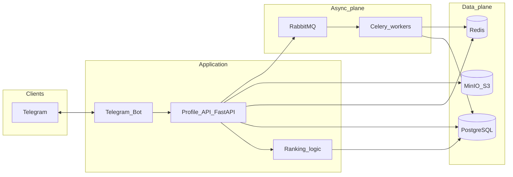
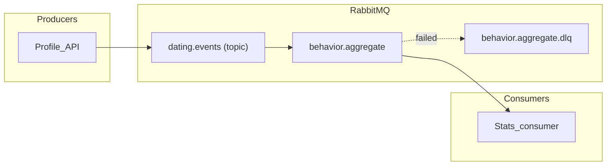
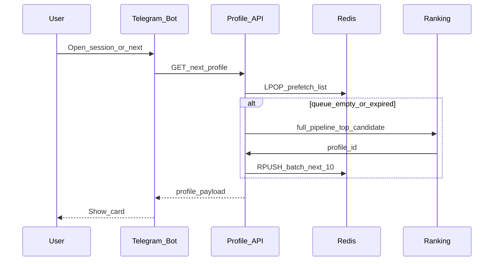

# Architecture

End-to-end design for the dating bot: Telegram client, FastAPI profile service, PostgreSQL, Redis prefetch, RabbitMQ (events and background tasks), MinIO for media, Celery for scheduled rating updates.

## High-level diagram



## RabbitMQ routing (design)

- **Producers:** **Profile API only** — the bot calls the API; events are published after successful persistence (single path, no duplicate publishes).
- **Exchange:** `dating.events` — type **topic** (or **headers** if you prefer explicit routing keys only).
- **Routing keys:** `profile.liked`, `profile.skipped`, `match.created` (see event catalog below).
- **Queues:**
  - `behavior.aggregate` — consumer updates `user_behavior_stats` (and may trigger rating jobs).
- **Durability:** durable exchange and queues; persistent messages for interaction events.
- **Failure handling:** DLQ per queue (e.g. `behavior.aggregate.dlq`) after max retries; poison messages inspected manually.




## Discovery and Redis prefetch

The API **`LPOP`**s the next id from a per-viewer Redis **LIST**; if empty or TTL-expired, it ranks the next candidate, **`RPUSH`**es ~10 ids, and returns the first.



### Redis key conventions

| Key | Role |
|-----|------|
| `discovery:queue:{viewer_user_id}` | FIFO list of next `profile_id`s. TTL ~15–30m; **DEL on pref change**; top up when len ≤ ~2. |
| `session:{viewer_user_id}` | Short-lived FSM / drafts (not DB truth). Use `callback_data` for buttons where possible. TTL + touch; DEL on done/cancel. One writer: Bot *or* API. |

Discovery = next cards; session = chat wizard state. Pref change → invalidate discovery only.

## Event catalog (RabbitMQ payloads)

Envelope (JSON, UTF-8):

```json
{
  "event_id": "uuid",
  "type": "profile.liked",
  "occurred_at": "2025-03-22T12:00:00Z",
  "schema_version": 1,
  "payload": {}
}
```

| type | payload (minimal) |
|------|-------------------|
| `profile.liked` | `actor_user_id`, `target_user_id`, `interaction_id` |
| `profile.skipped` | same |
| `match.created` | `match_id`, `user_a_id`, `user_b_id` |


## Background jobs (Celery)

Celery runs **on a schedule** (Celery Beat) to recompute **user ratings** and write results to the database, so swipes and API calls stay light. Optional extra jobs (e.g. cache maintenance) can live here too.


## Observability touchpoints

- FastAPI: request metrics, 4xx/5xx rates.
- RabbitMQ: queue depth, consumer utilization, DLQ rate.
- Celery: task success/failure, latency.
- Redis: memory, evictions, hit ratio for discovery keys.

## Related documents

- [services.md](./services.md) — per-service responsibilities.
- [database-schema.md](./database-schema.md) — PostgreSQL tables and indexes.
- Russian: [docs/ru/architecture.md](./ru/architecture.md) (same content).
