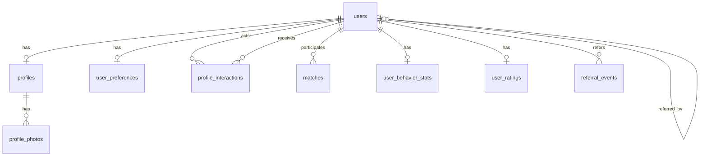

# Database schema (PostgreSQL)

Normalized storage for users, profiles, preferences, interactions, matches, behavioral aggregates, ratings, and referrals. Migrations: **Alembic**.

## ER diagram (overview)

## Tables

### `users`

| Column | Type | Notes |
|--------|------|--------|
| `id` | UUID | PK, default `gen_random_uuid()` |
| `telegram_id` | BIGINT | UNIQUE, NOT NULL |
| `username` | TEXT | Nullable; Telegram @ without @ |
| `created_at` | TIMESTAMPTZ | NOT NULL, default now |
| `is_active` | BOOLEAN | NOT NULL, default true |
| `referral_code` | TEXT | UNIQUE, human-shareable |
| `referred_by_user_id` | UUID | FK → `users(id)`, nullable |

**Indexes:** `UNIQUE(telegram_id)`, `UNIQUE(referral_code)`.

### `profiles`

One row per user (1:1). Discovery filters use these columns.

| Column | Type | Notes |
|--------|------|--------|
| `user_id` | UUID | PK/FK → `users(id)` ON DELETE CASCADE |
| `display_name` | TEXT | |
| `bio` | TEXT | |
| `birth_date` | DATE | Prefer over bare age for drift |
| `gender` | TEXT or ENUM | Align with app enums |
| `city` | TEXT | Display / filter; from geocoder or curated list |
| `district` | TEXT | Nullable; borough, suburb, or admin subdivision within `city` (big-city granularity) |
| `latitude` | DOUBLE PRECISION | Nullable |
| `longitude` | DOUBLE PRECISION | Nullable |
| `interests` | JSONB | Or normalize to `user_interests` + `interests` later |
| `completeness_score` | SMALLINT | 0–100, maintained by API/Celery |
| `updated_at` | TIMESTAMPTZ | |

**Indexes:** `(city)`, `(city, district)` if discovery filters by area; `(gender)` if filtered heavily; consider GiST on `(latitude, longitude)` or PostGIS later.

### `profile_photos`

| Column | Type | Notes |
|--------|------|--------|
| `id` | UUID | PK |
| `profile_id` | UUID | FK → `profiles(user_id)` |
| `s3_key` | TEXT | NOT NULL |
| `sort_order` | INT | NOT NULL, default 0 |
| `is_primary` | BOOLEAN | default false |
| `created_at` | TIMESTAMPTZ | |

**Indexes:** `(profile_id, sort_order)`.

### `user_preferences`

| Column | Type | Notes |
|--------|------|--------|
| `user_id` | UUID | PK/FK → `users(id)` |
| `age_min` | SMALLINT | |
| `age_max` | SMALLINT | |
| `gender_preferences` | TEXT[] or ENUM[] | |
| `max_distance_km` | INT | Nullable; optional max distance (km) between viewer and candidate when both have coordinates. When NULL, no distance cutoff is applied. |
| `updated_at` | TIMESTAMPTZ | |

### `profile_interactions`

| Column | Type | Notes |
|--------|------|--------|
| `id` | UUID | PK |
| `actor_user_id` | UUID | FK → `users` |
| `target_user_id` | UUID | FK → `users` |
| `action` | ENUM | `like`, `skip` |
| `created_at` | TIMESTAMPTZ | NOT NULL, default now |

**Indexes:** `(actor_user_id, created_at DESC)`, `(target_user_id, created_at DESC)`, `(target_user_id, action)` for aggregates. Optional UNIQUE `(actor_user_id, target_user_id)` if at most one row per pair is allowed (product rule).

### `matches`

**Used for:** recording that two users **mutually liked** each other (one row per pair). Enables “you matched” in the bot, optional handoff UX (contacts / external chat), **`matches_count`** and behavioral metrics, and **`match_id`** in events such as `match.created`.

**Pair ordering:** always store the same two users in a **fixed order** so `(A,B)` and `(B,A)` are one row — e.g. `user_a_id` = smaller UUID, `user_b_id` = larger UUID (same `LEAST` / `GREATEST` rule everywhere, including when publishing `match.created`).

| Column | Type | Notes |
|--------|------|--------|
| `id` | UUID | PK; stable id for this match |
| `user_a_id` | UUID | FK → `users`; first user in canonical order |
| `user_b_id` | UUID | FK → `users`; second user in canonical order |
| `created_at` | TIMESTAMPTZ | When the match row was created (second side of mutual like) |

**Indexes:** `UNIQUE(user_a_id, user_b_id)`.

### `user_behavior_stats`

Aggregates maintained by RabbitMQ consumers (and optionally reconciled by Celery).

| Column | Type | Notes |
|--------|------|--------|
| `user_id` | UUID | PK/FK |
| `likes_received` | INT | default 0 |
| `skips_received` | INT | default 0 |
| `views_implied` | INT | Nullable if not tracked |
| `matches_count` | INT | default 0 |
| `activity_histogram` | JSONB | Optional hour-of-week buckets (e.g. from interaction timestamps) |
| `updated_at` | TIMESTAMPTZ | |

### `user_ratings`

Separate table for recomputed scores (Celery).

| Column | Type | Notes |
|--------|------|--------|
| `user_id` | UUID | PK/FK |
| `primary_score` | DOUBLE PRECISION | Level 1 |
| `behavioral_score` | DOUBLE PRECISION | Level 2 |
| `referral_bonus` | DOUBLE PRECISION | Level 3 add-on |
| `combined_score` | DOUBLE PRECISION | Final |
| `breakdown` | JSONB | Optional component detail |
| `algorithm_version` | TEXT | e.g. `v1.0.0` |
| `computed_at` | TIMESTAMPTZ | |

**Indexes:** `(combined_score DESC)` for admin/ops queries.

### `referral_events` (audit)

| Column | Type | Notes |
|--------|------|--------|
| `id` | UUID | PK |
| `referrer_id` | UUID | FK |
| `referee_id` | UUID | FK |
| `credited_at` | TIMESTAMPTZ | |
| `bonus_applied` | DOUBLE PRECISION | |

Russian: [docs/ru/database-schema.md](./ru/database-schema.md).

