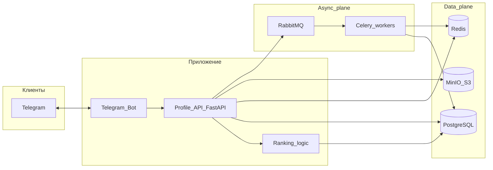
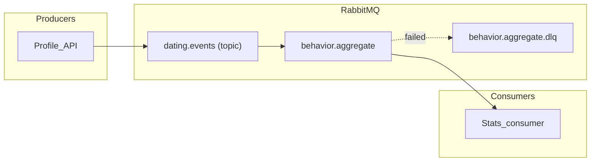
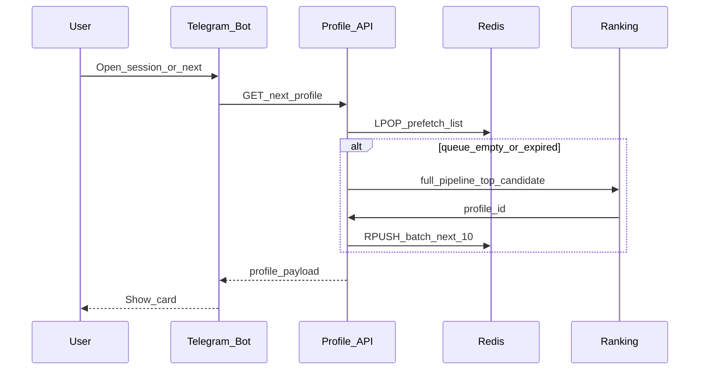

# Архитектура

Сквозное устройство dating-бота: клиент Telegram, сервис профилей на FastAPI, PostgreSQL, prefetch в Redis, RabbitMQ (события и фоновые задачи), MinIO для медиа, Celery для периодического обновления рейтингов.

## Диаграмма верхнего уровня



## Маршрутизация RabbitMQ (проект)

- **Producers:** только **Profile API** — бот вызывает API; события публикуются после успешного сохранения в БД (один путь, без дублирующих publish).
- **Exchange:** `dating.events` — тип **topic** (или **headers**, если нужны только явные routing keys).
- **Routing keys:** `profile.liked`, `profile.skipped`, `match.created` (каталог событий ниже).
- **Queues:**
  - `behavior.aggregate` — **consumer** обновляет `user_behavior_stats` (и при необходимости запускает пересчёт рейтинга).
- **Durability:** durable exchange и queues; **persistent** messages для событий взаимодействий.
- **Failure handling:** DLQ на queue (например `behavior.aggregate.dlq`) после лимита повторов; poison messages разбираются вручную.



## Discovery и prefetch в Redis

API забирает следующий id через **`LPOP`** из Redis **LIST**; если список пуст или ключ истёк по TTL, выполняется ранжирование следующего кандидата, в очередь **`RPUSH`** около 10 id, пользователю отдаётся первый.



### Соглашения по ключам Redis

| Key | Role |
|-----|------|
| `discovery:queue:{viewer_user_id}` | FIFO list следующих `profile_id`. TTL ~15–30 мин; **DEL при смене настроек**; дозаполнять при len ≤ ~2. |
| `session:{viewer_user_id}` | Краткоживущий FSM / черновики (не истина в БД). По возможности кнопки через `callback_data`. TTL + touch; DEL по завершении или отмене. Один writer: Bot *или* API. |

Discovery — очередь карточек; session — шаг сценария в чате. Смена настроек → инвалидировать только discovery.

## Каталог событий (payloads RabbitMQ)

**Envelope** (JSON, UTF-8):

```json
{
  "event_id": "uuid",
  "type": "profile.liked",
  "occurred_at": "2025-03-22T12:00:00Z",
  "schema_version": 1,
  "payload": {}
}
```

| type | payload (минимум) |
|------|-------------------|
| `profile.liked` | `actor_user_id`, `target_user_id`, `interaction_id` |
| `profile.skipped` | то же |
| `match.created` | `match_id`, `user_a_id`, `user_b_id` |


## Фоновые задачи (Celery)

Celery **по расписанию** (Celery Beat) пересчитывает **user ratings** и пишет результат в БД, чтобы свайпы и вызовы API оставались лёгкими. Сюда же можно вынести прочие задачи (например обслуживание cache).


## Observability

- FastAPI: request metrics, доля 4xx/5xx.
- RabbitMQ: queue depth, **consumer** utilization, DLQ rate.
- Celery: task success/failure, latency.
- Redis: memory, evictions, hit ratio по ключам discovery.

## Связанные документы

- [services.md](./services.md) — зоны ответственности сервисов.
- [database-schema.md](./database-schema.md) — таблицы и индексы PostgreSQL.
