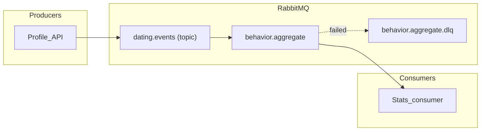
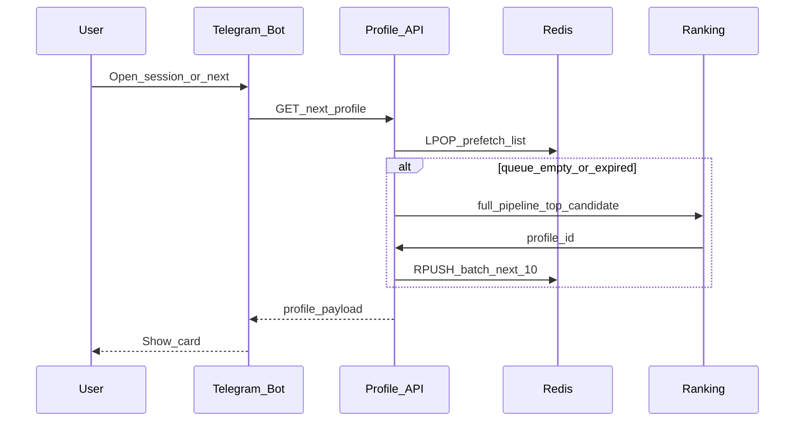

# Архитектура

## High-level diagram

```mermaid
flowchart LR
  subgraph clients [Clients]
    TG[Telegram]
  end
  subgraph app [Application]
    Bot[Telegram_Bot]
    API[Profile_API_FastAPI]
  end
  subgraph data [Data_plane]
    PG[(PostgreSQL)]
    RD[(Redis)]
    S3[(MinIO_S3)]
  end
  subgraph async_plane [Async_plane]
    MQ[RabbitMQ]
    Cel[Celery_workers (ranking logic)]
  end
  TG <--> Bot
  Bot --> API
  API --> PG
  API --> RD
  API --> S3
  API --> MQ
  MQ --> Cel
  Cel --> PG
  Cel --> RD
```

## RabbitMQ routing (design)

- **Producers:** только **Profile API** — бот вызывает API
- **Exchange:** `dating.events` — type **topic**
- **Routing keys:** `profile.liked`, `profile.skipped`, `match.created`
- **Queues:**
  - `behavior.aggregate` — consumer обновляет `user_behavior_stats`
- **Failure handling:** сообщение отправляем в DLQ после retries; poison messages разбираются вручную.



## Discovery and Redis prefetch

API делает **`LPOP`** следующего id из per-viewer Redis **LIST**; если пусто или TTL истёк, запускает ранжирование следующего кандидата, делает **`RPUSH`** примерно 10 id и отдаёт первый.



### Redis key conventions

| Key | Role |
|-----|------|
| `discovery:queue:{viewer_user_id}` | FIFO list следующих `profile_id`. TTL ~15–30m; **DEL при изменении prefs**; пополнять при len ≤ ~2. |
| `session:{viewer_user_id}` | Short-lived FSM / drafts (не DB truth). Для кнопок по возможности использовать `callback_data`. TTL + touch; DEL при done/cancel. Один writer: Bot *или* API. |

Discovery = следующие карточки; session = состояние chat wizard. Изменились prefs → инвалидировать только discovery.

## Event catalog (RabbitMQ payloads)

Envelope (JSON, UTF-8):

```json
{
  "event_id": "uuid",
  "type": "profile.liked",
  "occurred_at": "2025-03-22T12:00:00Z",
  "schema_version": 1,
  "payload": {}
}
```

| type | payload (минимум) |
|------|-------------------|
| `profile.liked` | `actor_user_id`, `target_user_id`, `interaction_id` |
| `profile.skipped` | same |
| `match.created` | `match_id`, `user_a_id`, `user_b_id` |

## Background jobs (Celery)

Celery работает в двух режимах: **workers** обрабатывают фоновые задачи из queue, а **Celery Beat** запускает scheduled jobs. Основной сценарий — пересчёт **user ratings** с записью в БД; сюда же можно добавить maintenance jobs.

## Observability touchpoints

- FastAPI: request metrics, 4xx/5xx rates.
- RabbitMQ: queue depth, consumer utilization, DLQ rate.
- Celery: task success/failure, latency.
- Redis: memory, evictions, hit ratio для discovery keys.
