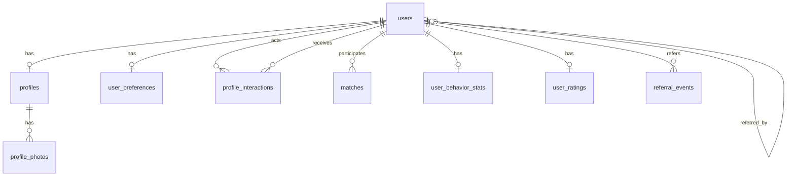

# Схема базы данных (PostgreSQL)

Нормализованное хранение пользователей, профилей, настроек, взаимодействий, матчей, поведенческих агрегатов, рейтингов и рефералов. Миграции: **Alembic**.

## ER-диаграмма (обзор)

## Таблицы

### `users`

| Column | Type | Примечание |
|--------|------|------------|
| `id` | UUID | PK, default `gen_random_uuid()` |
| `telegram_id` | BIGINT | UNIQUE, NOT NULL |
| `username` | TEXT | Nullable; Telegram @ без @ |
| `created_at` | TIMESTAMPTZ | NOT NULL, default now |
| `is_active` | BOOLEAN | NOT NULL, default true |
| `referral_code` | TEXT | UNIQUE, удобен для передачи человеку |
| `referred_by_user_id` | UUID | FK → `users(id)`, nullable |

**Indexes:** `UNIQUE(telegram_id)`, `UNIQUE(referral_code)`.

### `profiles`

Одна строка на пользователя (1:1). Фильтры discovery используют эти колонки.

| Column | Type | Примечание |
|--------|------|------------|
| `user_id` | UUID | PK/FK → `users(id)` ON DELETE CASCADE |
| `display_name` | TEXT | |
| `bio` | TEXT | |
| `birth_date` | DATE | Предпочтительнее одного поля «возраст» из-за устаревания |
| `gender` | TEXT or ENUM | Согласовать с enum приложения |
| `city` | TEXT | Отображение / фильтр; из геокодера или справочника |
| `district` | TEXT | Nullable; район, пригород или адм. единица внутри `city` (детализация в крупных городах) |
| `latitude` | DOUBLE PRECISION | Nullable |
| `longitude` | DOUBLE PRECISION | Nullable |
| `interests` | JSONB | Позже можно нормализовать в `user_interests` + `interests` |
| `completeness_score` | SMALLINT | 0–100, обновляют API/Celery |
| `updated_at` | TIMESTAMPTZ | |

**Indexes:** `(city)`, `(city, district)` при фильтрации по району; `(gender)` при частых фильтрах; позже GiST по `(latitude, longitude)` или PostGIS.

### `profile_photos`

| Column | Type | Примечание |
|--------|------|------------|
| `id` | UUID | PK |
| `profile_id` | UUID | FK → `profiles(user_id)` |
| `s3_key` | TEXT | NOT NULL |
| `sort_order` | INT | NOT NULL, default 0 |
| `is_primary` | BOOLEAN | default false |
| `created_at` | TIMESTAMPTZ | |

**Indexes:** `(profile_id, sort_order)`.

### `user_preferences`

| Column | Type | Примечание |
|--------|------|------------|
| `user_id` | UUID | PK/FK → `users(id)` |
| `age_min` | SMALLINT | |
| `age_max` | SMALLINT | |
| `gender_preferences` | TEXT[] or ENUM[] | |
| `max_distance_km` | INT | Nullable; опциональный максимум расстояния (км) между зрителем и кандидатом при координатах у обоих. NULL — без отсечения по дистанции. |
| `updated_at` | TIMESTAMPTZ | |

### `profile_interactions`

| Column | Type | Примечание |
|--------|------|------------|
| `id` | UUID | PK |
| `actor_user_id` | UUID | FK → `users` |
| `target_user_id` | UUID | FK → `users` |
| `action` | ENUM | `like`, `skip` |
| `created_at` | TIMESTAMPTZ | NOT NULL, default now |

**Indexes:** `(actor_user_id, created_at DESC)`, `(target_user_id, created_at DESC)`, `(target_user_id, action)` для агрегатов. По правилам продукта — опционально UNIQUE `(actor_user_id, target_user_id)` не более одной строки на пару.

### `matches`

**Назначение:** зафиксировать **взаимный лайк** двух пользователей (одна строка на пару). Нужно для «вы мэтчились» в боте, опционального UX (контакты / внешний чат), метрики **`matches_count`** и **`match_id`** в событиях вроде `match.created`.

**Pair ordering:** два пользователя всегда в **фиксированном порядке**, чтобы `(A,B)` и `(B,A)` были одной строкой — например `user_a_id` = меньший UUID, `user_b_id` = больший (одно правило `LEAST` / `GREATEST` везде, включая publish `match.created`).

| Column | Type | Примечание |
|--------|------|------------|
| `id` | UUID | PK; стабильный id матча |
| `user_a_id` | UUID | FK → `users`; первый в каноническом порядке |
| `user_b_id` | UUID | FK → `users`; второй в каноническом порядке |
| `created_at` | TIMESTAMPTZ | Создание строки матча (вторая сторона взаимного лайка) |

**Indexes:** `UNIQUE(user_a_id, user_b_id)`.

### `user_behavior_stats`

Агрегаты обновляют **consumers** RabbitMQ (при необходимости сверка через Celery).

| Column | Type | Примечание |
|--------|------|------------|
| `user_id` | UUID | PK/FK |
| `likes_received` | INT | default 0 |
| `skips_received` | INT | default 0 |
| `views_implied` | INT | Nullable, если показы не считаем |
| `matches_count` | INT | default 0 |
| `activity_histogram` | JSONB | Опционально корзины по часам недели (например по timestamp взаимодействий) |
| `updated_at` | TIMESTAMPTZ | |

### `user_ratings`

Отдельная таблица пересчитанных оценок (Celery).

| Column | Type | Примечание |
|--------|------|------------|
| `user_id` | UUID | PK/FK |
| `primary_score` | DOUBLE PRECISION | Уровень 1 |
| `behavioral_score` | DOUBLE PRECISION | Уровень 2 |
| `referral_bonus` | DOUBLE PRECISION | Добавка уровня 3 |
| `combined_score` | DOUBLE PRECISION | Итог |
| `breakdown` | JSONB | Опционально детализация по компонентам |
| `algorithm_version` | TEXT | например `v1.0.0` |
| `computed_at` | TIMESTAMPTZ | |

**Indexes:** `(combined_score DESC)` для admin/ops запросов.

### `referral_events` (audit)

| Column | Type | Примечание |
|--------|------|------------|
| `id` | UUID | PK |
| `referrer_id` | UUID | FK |
| `referee_id` | UUID | FK |
| `credited_at` | TIMESTAMPTZ | |
| `bonus_applied` | DOUBLE PRECISION | |

English: [database-schema.md](../database-schema.md).
