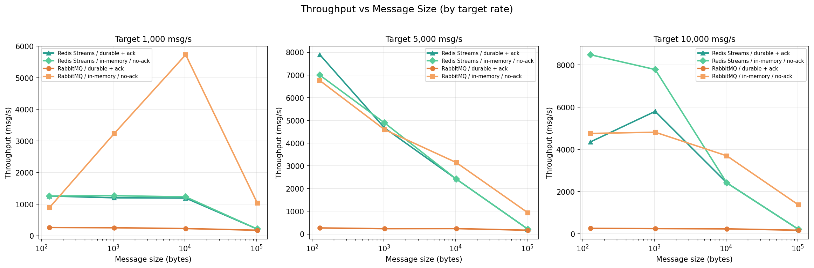
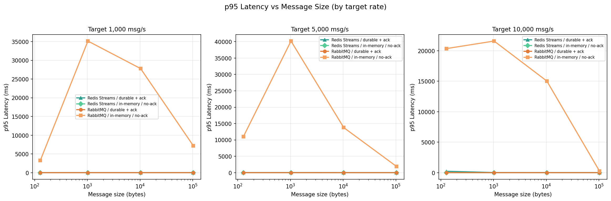
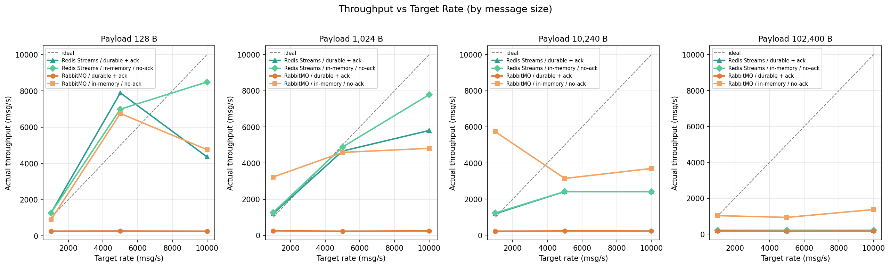
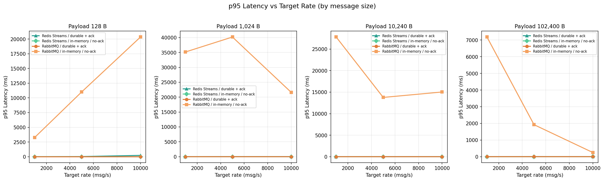
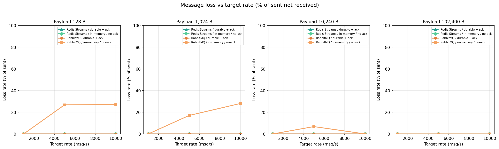

# RabbitMQ vs Redis Streams — Benchmark Report

## Summary

| Broker | Config | Target msg/s | Avg throughput (msg/s)* | Avg p95 (ms)* | Avg loss (%)* |
|--------|--------|-------------|--------------------------|--------------|---------------|
| Redis Streams | durable + ack | 1,000 | 965 | 2.36 | 0.00 |
| Redis Streams | durable + ack | 5,000 | 3,796 | 20.20 | 0.00 |
| Redis Streams | durable + ack | 10,000 | 3,197 | 66.96 | 0.00 |
| Redis Streams | in-memory / no-ack | 1,000 | 992 | 0.82 | 0.00 |
| Redis Streams | in-memory / no-ack | 5,000 | 3,627 | 0.91 | 0.00 |
| Redis Streams | in-memory / no-ack | 10,000 | 4,724 | 1.66 | 0.00 |
| RabbitMQ | durable + ack | 1,000 | 229 | 2.06 | 0.00 |
| RabbitMQ | durable + ack | 5,000 | 226 | 2.20 | 0.00 |
| RabbitMQ | durable + ack | 10,000 | 228 | 2.10 | 0.00 |
| RabbitMQ | in-memory / no-ack | 1,000 | 2,718 | 18351.62 | 0.00 |
| RabbitMQ | in-memory / no-ack | 5,000 | 3,855 | 16724.87 | 12.68 |
| RabbitMQ | in-memory / no-ack | 10,000 | 3,660 | 14305.53 | 13.78 |

_Averages are over message sizes only (same broker, config, and target rate)._
_`Avg loss (%)` uses each row’s `sent_count` and `recv_count`: `max(0, sent − recv) / sent × 100`, capped at 100%._

> Total experiment runs: **48**

---

## Charts

### Throughput vs Message Size



### p95 Latency vs Message Size



### Throughput vs Target Rate (Degradation Curve)



### p95 Latency vs Target Rate



### Message Loss Rate vs Target Rate




---

## Methodology

- **Brokers**: RabbitMQ 3.13, Redis 7.2 (Streams)
- **Resource limits**: 2 CPU / 1 GB RAM per broker container
- **Configs tested**:
  - `durable_ack` — RabbitMQ: durable queue + publisher confirms + consumer ack; Redis: AOF enabled + XACK
  - `inmemory_noack` — RabbitMQ: transient queue, no confirms; Redis: no AOF, no XACK
- **Latency measurement**: `send_ts` embedded in each message body (monotonic clock); computed consumer-side as `recv_time - send_ts`
- **Warmup (steady metrics)**: first `warmup_seconds` after the **first received message** are excluded from latency samples and from steady throughput (`recv_steady` / steady wall time). Total `recv_count` still includes warmup messages.
- **Loss rate in charts**: `max(0, sent_count − recv_count) / sent_count × 100`, capped at 100% (end-to-end from CSV). The consumer still records **seq-gap** `lost_count` in the CSV as a separate diagnostic.
- **Rate control**: async token-bucket limiter in the producer
- **Charts**: throughput/latency vs **size** use one column per **target rate** (no averaging across rates). vs **rate** charts use one column per **message size** (no averaging across sizes).

---

## How to Reproduce

```bash
# 1. Start brokers and services
docker compose up --build -d

# 2. Wait for healthchecks to pass (~30s), then run
cd runner
pip install httpx
python runner.py --duration 60

# 3. Generate this report
python report.py
```

---

*Generated automatically by `runner/report.py`*
